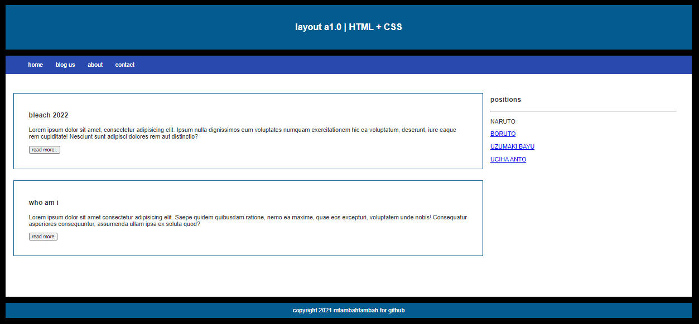

# layout a1.0
layout A1.0 | HTML + CSS


## `1` buat file html dan css dengan nama bebas :
`html`
```html
<!DOCTYPE html>
<html lang="en">
<head>
    <meta charset="UTF-8">
    <meta http-equiv="X-UA-Compatible" content="IE=edge">
    <meta name="viewport" content="width=device-width, initial-scale=1.0">
    <title>Document</title>
    <!-- css -->
    <!-- /css -->
</head>
<body>
    <!-- header -->
    <!-- /header -->
    <!-- menu -->
    <!-- /menu -->
    <!-- content -->
    <!-- /content -->
    <!-- footer -->
    <!-- /footer -->
</body>
</html>
```

`css`
```css
/* body */
/* /body */
/* header */
/* /header */
/* menu */
/* /menu */
/* content */
/* /content */
/* kiri */
/* /kiri */
/* kanan */
/* /kanan */
/* footer */
/* /footer */
```

## `2` hubungkan css
```html
<link rel="stylesheet" href="./index.css">
```
kemudian isi css :
```css
body{
    background: black;
    color: #333;
    width: 100%;
    font-family: sans-serif;
    margin: 0 auto;
}
```

## `3` header
`html`
```html
<div class="header">
  <h2>layout a1.0 | HTML + CSS</h2>
</div>
```
`css`
```css
.header{
    width: 90%;
    margin: auto;
    height: 120px;
    line-height: 120px;
    background-color: #045b8e;
    color: white;
}

h2{
    text-align: center;
}
```
## `4` menu
`html`
```html
<div class="menu">
        <ul>
            <li><a href="#">home</a></li>
            <li><a href="#">blog us</a></li>
            <li><a href="#">about</a></li>
            <li><a href="#">contact</a></li>
        </ul>
    </div>
```
`css`
```css
.menu{
    background: #2a49af;
    height: 50px;
    line-height: 50px;
    position: relative;
    width: 90%;
    margin: 0 auto;
    padding: 0 auto;
}

.menu ul{
    list-style: none;
}

.menu ul li a{
    float: left;
    width: 80px;
    display: block;
    text-align: center;
    color: white;
    text-decoration: none;
}

.menu ul li a:hover{
    background-color: #045b8e;
    display: block;
}
```

## `5` content
```html
<div class="content">
        <div class="jarak">
            <div class="kiri">
                <div class="border">
                    <div class="jarak">
                        <h3>bleach 2022</h3>
                        <p>
                            Lorem ipsum dolor sit amet, consectetur adipisicing elit. Ipsum nulla dignissimos eum voluptates numquam exercitationem hic ea voluptatum, deserunt, iure eaque rem cupiditate! Nesciunt sunt adipisci dolores rem aut distinctio?
                        </p>
                        <button class="btn">read more..</button>
                    </div>
                </div>
                <div class="border">
                    <div class="jarak">
                        <h3>who am i</h3>
                        <p>
                            Lorem ipsum dolor sit amet consectetur adipisicing elit. Saepe quidem quibusdam ratione, nemo ea maxime, quae eos excepturi, voluptatem unde nobis! Consequatur asperiores consequuntur, assumenda ullam ipsa ex soluta quod?
                        </p>
                        <button class="btn">read more</button>
                    </div>
                </div>
            </div>
            <div class="kanan">
                <div class="jarak">
                    <h3>positions</h3>
                    <hr>
                    <p><a href="#" class="undercover"></a>NARUTO</p>
                    <p><a href="#" class="undercover">BORUTO</a></p>
                    <p><a href="#" class="undercover">UZUMAKI BAYU</a></p>
                    <p><a href="#" class="undercover">UCIHA ANTO</a></p>
                </div>
            </div>
        </div>
</div>
```
```css
.content{
    width: 90%;
    margin: auto;
    height: 600px;
    padding: 0.1px;
    background: white;
    color:#333;
}

.jarak{
    padding: 20px 20px;
}


.kiri{
    width: 70%;
    float: left;
    margin:auto;
    background-color: white;
    height: 420px;
}

.kanan{
    width: 30%;
    float: left;
    margin: auto;
    background: white;
    height: 420px;
}
```
## `6` footer
`html`
```html
<div class="footer">
  <p>copyright 2021 mtambahtambah for github</p>
</div>
```
`css`
```css
.footer{
    width: 90%;
    margin: auto;
    height: 40px;
    line-height: 40px;
    background: #045b8e;
    color: white;
    text-align: center;
}
```